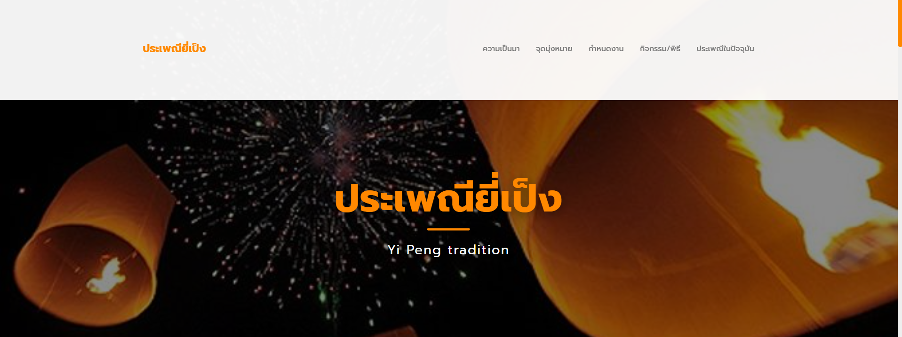
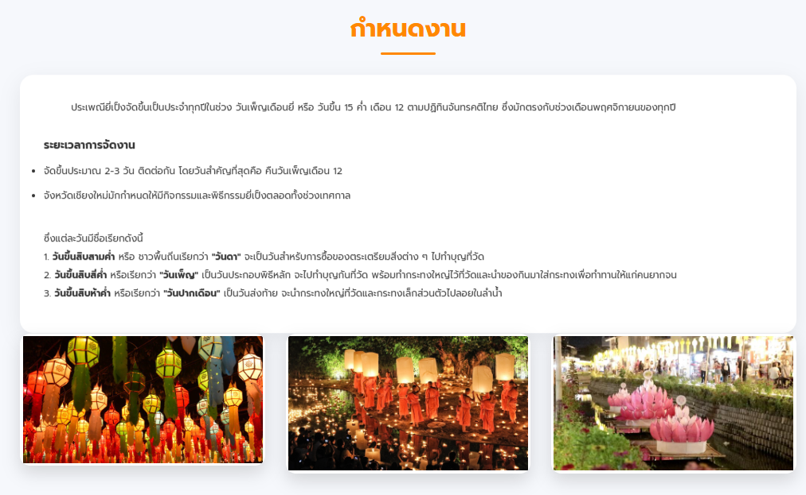

# Yi Peng Tradition Website

This website presents information about the **Yi Peng Festival**, an important cultural tradition of the Lanna people in Northern Thailand. The project was developed to provide knowledge about the festival's history, objectives, schedule, activities, and its preservation in modern society.

## Features

* Display information about the history of the Yi Peng Festival
* Explain the objectives and cultural significance of the tradition
* Present event schedules and festival activities
* Include an image gallery to enhance user engagement
* Responsive design for both desktop and mobile devices
* Developed using Bootstrap and custom CSS styling

## Technologies Used

* HTML5
* CSS3
* Bootstrap 3
* JavaScript

## Website Structure

* About
* Objectives
* Schedule
* Activities and Ceremonies
* Yi Peng Festival in the Present Day
* Contact

## Project Objective

The purpose of this project is to improve web development skills using HTML, CSS, and Bootstrap while promoting awareness of Thai culture and traditions through a user-friendly website.

## Website Preview

## Author
Sarochinee Bunyarit

------------------------------------------------------------------------------
# ประเพณียี่เป็ง (Yi Peng Tradition)

เว็บไซต์นำเสนอข้อมูลเกี่ยวกับประเพณียี่เป็ง ซึ่งเป็นประเพณีสำคัญของชาวล้านนาในภาคเหนือของประเทศไทย โดยเว็บไซต์นี้จัดทำขึ้นเพื่อเผยแพร่ความรู้เกี่ยวกับความเป็นมา จุดมุ่งหมาย กำหนดการ กิจกรรม และการสืบสานประเพณียี่เป็งในปัจจุบัน

## คุณสมบัติของเว็บไซต์

* แสดงข้อมูลประวัติความเป็นมาของประเพณียี่เป็ง
* อธิบายจุดมุ่งหมายและความสำคัญของประเพณี
* แสดงกำหนดการและกิจกรรมภายในงาน
* มีแกลเลอรีภาพประกอบเพื่อเพิ่มความน่าสนใจ
* รองรับการแสดงผลบนอุปกรณ์ Desktop และ Mobile
* ใช้ Bootstrap และ CSS ในการออกแบบหน้าเว็บไซต์

## เทคโนโลยีที่ใช้

* HTML5
* CSS3
* Bootstrap 3
* JavaScript

## โครงสร้างเว็บไซต์

* ความเป็นมา (About)
* จุดมุ่งหมายประเพณี (Objective)
* กำหนดงาน (Schedule)
* กิจกรรมและพิธีกรรม (Activities)
* ประเพณียี่เป็งในปัจจุบัน (Present Day)
* ช่องทางติดต่อ (Contact)

## วัตถุประสงค์ของโครงการ

เพื่อศึกษาและพัฒนาทักษะการออกแบบเว็บไซต์ด้วย HTML, CSS และ Bootstrap พร้อมทั้งเผยแพร่ข้อมูลเกี่ยวกับวัฒนธรรมและประเพณีไทยให้เป็นที่รู้จักมากยิ่งขึ้น

## ต้วอย่างหน้าเว็บ

## ผู้จัดทำ

Sarochinee Bunyarit

